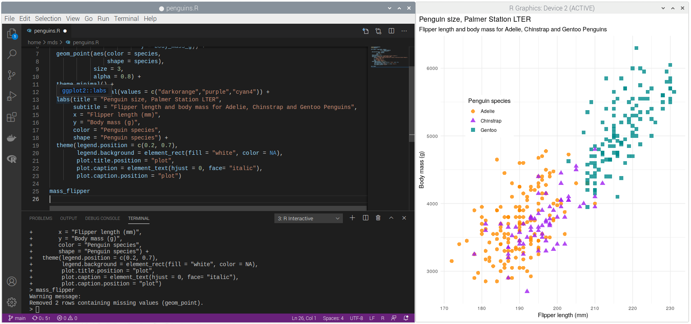

# R for the Raspberry Pi

The aim of r4pi.org is to provide an up-to-date version of R for the Raspberry Pi computer.

In addition, we provide access to pre-compiled versions of some of R's most popular packages.

**Note:** This project is currently in early beta stage, so you should expect to find the odd bug here and there.

## Background

R is the premier language for statistical computing and has millions of users around the world.

There's already a build available for the Raspberry Pi in the default OS repos, but it's a quite an old version.

We provide up-to-date builds of R and also take a number of the extension packages from CRAN and pre-compile them ready
for use on the Pi to make installation fast and simple.

## R in action

It's possible to write R code in any text editor and a number of the text editors and IDEs available for the Pi support
R either straight out-of-the-box or, as in the VSCode screenshot below, with the addition of a plugin.

The screenshot above shows some of the analytical and plotting capabilities of R with code borrowed from the 
["palmerpenguins" package website](https://allisonhorst.github.io/palmerpenguins/).

## Installation

Now you know what the project is all about, it's time to move on to [installation](docs/installation.md).

